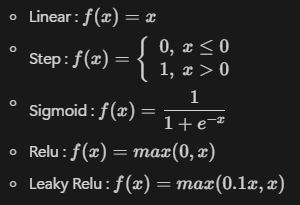
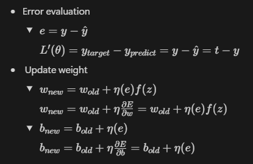

# perceptron concept
perceptron คือ โครงข่ายประสาทเทียม เป็นองค์ประกอบสำคัญที่อยู่ใน Neural Network
ใช้ในการจำลองการทำงานของ neuron cell

# perceptron formula

# activation function

# error evaluate and update weight/bias
